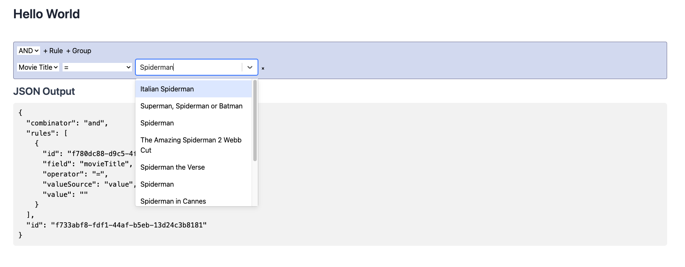

# React Vite Express Boilerplate

A boilerplate project for building a React Single Page Application (SPA) using [Vite](https://vitejs.dev/) for fast builds and [Express.js](https://expressjs.com/) as a backend server. The Express server also functions as a Backend for Frontend (BFF) proxy for third-party APIs, ensuring secure and efficient API requests.

## Features

- ⚡ **Vite** for lightning-fast development and optimized production builds.
- ⚛️ **React** for building an interactive SPA.
- 🌐 **Express.js** backend for serving the application and handling API proxying.
- 🔒 **BFF Proxy** to securely handle third-party API calls from the server.
- 🛠️ Example frontend integration with **React Query Builder** and **React Select**.
- 🎥 Integration with the **OMDb API** to fetch movie data as a sample third-party API.
- 📂 Well-structured codebase for easy scalability and maintenance.
- 🛠️ Ready for deployment with minimal configuration.

---

## Getting Started

### Prerequisites

Ensure you have the following installed:

- [Node.js](https://nodejs.org/) (version 16+ recommended)
- [npm](https://www.npmjs.com/) or [yarn](https://yarnpkg.com/)

### Installation

1. Clone the repository:
   ```bash
   git clone https://github.com/ryanpeacock/reactvite-express-boiler.git
   cd reactvite-express-boiler
   ```

2. Install dependencies:
   ```bash
   npm install
   ```

3. Set up your `.env` file:
   - Create a `.env` file in the root directory by copying `.env.copy`:
     ```bash
     cp .env.copy .env
     ```
   - Set the following variables in the `.env` file:
     ```plaintext
     NODE_ENV=local
     OMDB_API_KEY=your_api_key_here
     ```
   - Use `NODE_ENV=local` or `NODE_ENV=development` for local development and `NODE_ENV=production` to serve production-ready files.

### Running the Application

#### Development Mode

Run both the frontend and backend in development mode:
```bash
npm run dev
```
This starts:
- The Vite development server for the React SPA.
- The Express backend server.

Access the app at `http://localhost:5173` by default.

#### Production Mode

Build the application and serve the production files:
```bash
npm run servebuildclient
```

This command:
1. Compiles the server TypeScript code.
2. Builds the React client.
3. Starts the server to serve production files.

---

## Project Structure

```plaintext
reactvite-express-boiler/
├── client/                 # Frontend (React + Vite)
│   ├── dist/               # Production build output
│   ├── public/
│   ├── src/
│   └── vite.config.ts
├── src/                    # Backend (Express.js)
│   ├── middlewares/        # Custom middleware
│   ├── types/              # TypeScript definitions
│   └── server.ts           # Main server entry point
├── dist/                   # Compiled backend files
├── .env                    # Environment variables
├── .env.copy               # Example environment variables file
├── package.json            # Project dependencies and scripts
└── README.md               # Project documentation
```

---

## Scripts

| Script                 | Description                                                           |
|------------------------|-----------------------------------------------------------------------|
| `npm run serverbuild`  | Compiles the server TypeScript code into JavaScript.                 |
| `npm run clientbuild`  | Builds the React application into the `client/dist` folder.         |
| `npm run server`       | Starts the Express server in development mode with Nodemon.         |
| `npm run client`       | Starts the Vite development server for the React app.               |
| `npm run dev`          | Runs both the backend and frontend in development mode concurrently.|
| `npm run start`        | Starts the compiled Express server to serve production files.       |
| `npm run servebuildclient` | Builds both the backend and frontend, then starts the server.   |

---

## Sample Component: React Query Builder + React Select + OMDb API

This boilerplate includes an example test component demonstrating the usage of **React Query Builder** and **React Select** to interact with the **OMDb API**. The example allows you to:

1. Build a query to search for movies.
2. Use dropdown selections (powered by **React Select**) to filter or refine searches.
3. Fetch movie data from the OMDb API using the query builder.

### Screenshot

Here is an example of the sample component in action:



### Using the Sample Component

1. Ensure you have set up your `.env` file with a valid `OMDB_API_KEY` as described above.
2. Navigate to the test component route in your application (check the codebase for the specific path).
3. Use the query builder and dropdowns to search for movies and view the results fetched from the OMDb API.

---

## Contributing

Contributions are welcome! Please fork the repository and create a pull request with your changes. For major changes, please open an issue to discuss them first.

---

## License

This project is licensed under the [MIT License](LICENSE).

---

## Acknowledgements

- [Vite](https://vitejs.dev/)
- [React](https://reactjs.org/)
- [Express.js](https://expressjs.com/)
- [OMDb API](https://www.omdbapi.com/)

---
